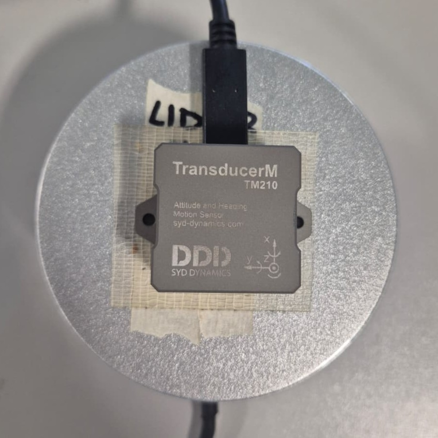

# LIO-SAM Catania ROS 2 Jazzy Setup

This guide explains how to install and start the ROS 2 Jazzy setup for the LIO-SAM Catania project using Distrobox.

---

## Requirements

- Ubuntu 24.04
- Distrobox
- ROS 2 Jazzy container image
- Velodyne VLP-16
- Transducer TM210 IMU

---

## Physical Setup

Although the IMU and LiDAR were physically mounted in the same direction, the sensor coordinate convention did not initially match the ROS REP-103 frame convention.

This was identified through a manual translation test: a physical movement along the intended x-axis mainly resulted in a y-axis displacement in `/lio_sam/mapping/odometry`. After correcting the relative yaw alignment by 90 degrees, translations and rotations around all axes were consistent.

When setting up the TransducerM TM210 IMU, the system gave wrong roll and pitch values even though the IMU and LiDAR were mounted in the same direction. Rotating the IMU 90 degrees fixed the problem. This is most likely caused by the IMU's internal sensor not being aligned with its outer casing, though a bug in the driver code cannot be ruled out. Since the fix worked well and the system behaved correctly afterwards, we did not investigate further and focused on optimizing the rest of the system.



This means:

```text
IMU x = LiDAR y
IMU y = -LiDAR x
```

After applying this physical and coordinate rotation, the system worked very well.

---

## Choose Your Installation Method

This guide mainly focuses on the quick-start installation using our prepared repository.

However, it also includes an alternative setup from scratch.

> **Note:** If you choose the from-scratch installation, follow the additional manual change instructions below the installation guide.

---

# Installation Guide

## 1. Create and Enter the ROS 2 Jazzy Distrobox Container

Run this in the terminal:

```bash
distrobox create --name ros-jazzy --image docker.io/osrf/ros:jazzy-desktop --pull
distrobox enter ros-jazzy
```

## 2. Install Dependencies Inside the Distrobox Container

```bash
echo "source /opt/ros/jazzy/setup.bash" >> ~/.bashrc
source ~/.bashrc

sudo apt update

sudo apt install -y \
    curl \
    gnupg \
    software-properties-common \
    ros-jazzy-navigation2 \
    ros-jazzy-nav2-bringup \
    ros-jazzy-robot-localization \
    ros-jazzy-robot-state-publisher \
    ros-jazzy-perception-pcl \
    ros-jazzy-pcl-msgs \
    ros-jazzy-vision-opencv \
    ros-jazzy-xacro \
    ros-jazzy-velodyne \
    libboost-all-dev \
    cmake \
    libmetis-dev \
    libeigen3-dev
```

## 3. Install GTSAM

```bash
sudo apt update
sudo apt install -y libgtsam-dev libgtsam-unstable-dev
cd ~
git clone --branch 4.2 https://github.com/borglab/gtsam.git
cd gtsam
mkdir build && cd build
cmake \
  -DGTSAM_BUILD_UNSTABLE=ON \
  -DGTSAM_USE_SYSTEM_EIGEN=ON \
  -DGTSAM_USE_QUATERNIONS=OFF \
  -DGTSAM_WITH_TBB=OFF \
  -DGTSAM_BUILD_EXAMPLES_ALWAYS=OFF \
  -DGTSAM_BUILD_TESTS=OFF \
  ..

make -j$(nproc)
sudo make install
```

## 4. Create the ROS 2 Workspace and Clone the Repository

### Option A: Quick Start With Our Prepared Repository

Use this option if you want to use the already prepared project repository.

Create the ROS 2 workspace:

```bash
mkdir -p ~/ros2_LIO_SAM_ws
cd ~/ros2_LIO_SAM_ws
```
Then clone the repo:

```bash
git clone https://github.com/Spodymun/lio-sam-carusi src
```

### Option B: Build the Setup From Scratch

Use this option if you want to start from the original repositories and apply the required changes manually.

Create the ROS 2 workspace:

```bash
mkdir -p ~/ros2_LIO_SAM_ws/src
cd ~/ros2_LIO_SAM_ws/src
```

Clone LIO-SAM and Velodyne:

```bash
git clone https://github.com/pixwyh/LIO-SAM-ROS2.git
git clone https://github.com/ros-drivers/velodyne.git
```

Then apply the required `CMakeLists.txt` changes for LIO-SAM:

```bash
cd ~/ros2_LIO_SAM_ws/src/LIO-SAM-ROS2

python3 - <<'PY'
from pathlib import Path

p = Path("CMakeLists.txt")
text = p.read_text()

text = text.replace("find_package(Eigen REQUIRED)", "find_package(Eigen3 REQUIRED)")
text = text.replace("Eigen\n", "Eigen3\n")
text = text.replace("Eigen ", "Eigen3 ")

new_include = '''include_directories(
    include
    include/lio_sam
    ${PCL_INCLUDE_DIRS}
    ${Eigen3_INCLUDE_DIRS}
    "/usr/include/gtsam"
)
'''

if "include_directories(" in text:
    start = text.find("include_directories(")
    depth = 0
    end = None

    for i in range(start, len(text)):
        if text[i] == "(":
            depth += 1
        elif text[i] == ")":
            depth -= 1
            if depth == 0:
                end = i + 1
                break

    if end is not None:
        text = text[:start] + new_include + text[end:]
else:
    text = new_include + "\n" + text

p.write_text(text)
print("CMakeLists.txt updated.")
PY
```

Then download the TransducerM ROS 2 example package from:

```text
https://www.syd-dynamics.com/download/transducerm_example_ros2-pkg/
```

After downloading it:

1. Go to your `Downloads` folder.
2. Unpack the downloaded archive.
3. Open the unpacked folder.
4. Go one folder deeper if there is another folder inside.
5. Rename the actual ROS 2 package folder to:

```text
tm_imu
```

6. Copy the renamed `tm_imu` folder into your workspace source folder:

```bash
cp -r ~/Downloads/tm_imu ~/ros2_LIO_SAM_ws/src/
```

If the renamed `tm_imu` folder is still inside another unpacked folder, use this pattern instead:

```bash
cp -r ~/Downloads/<UNPACKED_FOLDER>/<INNER_FOLDER>/tm_imu ~/ros2_LIO_SAM_ws/src/
```

At the end, your source folder should contain:

```text
~/ros2_LIO_SAM_ws/src/LIO-SAM-ROS2
~/ros2_LIO_SAM_ws/src/velodyne
~/ros2_LIO_SAM_ws/src/tm_imu
```

## 5. Change the IMU Port to Match Your System

In general, you need to set the correct `imu_port`.

Directly after plugging in the IMU, check the port in the terminal with:

```bash
dmesg | tail -30
```

This command shows which port the IMU is connected to.

After that, change the port in the following file:

```text
~/ros2_LIO_SAM_ws/src/tm_imu/config/params.yaml
```

## 6. Install ROS Dependencies

```bash
cd ~/ros2_LIO_SAM_ws

source /opt/ros/jazzy/setup.bash

rosdep install -i --from-path src --rosdistro jazzy -y
rosdep install --from-path src --ignore-src -r -y
```

## 7. Build the Workspace

Go to the workspace root:

```bash
cd ~/ros2_LIO_SAM_ws
```

Source ROS 2 Jazzy:

```bash
source /opt/ros/jazzy/setup.bash
```

### If you are using Option A: 
Quick Start With Our Prepared Repository**, the required changes are already included. In this case, you can directly build the workspace.

Build the workspace:

```bash
colcon build --symlink-install --cmake-args -DGTSAM_DIR=/usr/lib/x86_64-linux-gnu/cmake/GTSAM
```

Source the workspace:

```bash
source install/setup.bash
```

### If you are using Option B: 
Build the Setup From Scratch**, the `CMakeLists.txt` file inside the LIO-SAM package has to be adapted before building.

Open the `CMakeLists.txt` file inside the LIO-SAM folder and apply the following changes:

Replace:

```cmake
find_package(Eigen REQUIRED)
```

with:

```cmake
find_package(Eigen3 REQUIRED)
```

Then search for all `ament_target_dependencies(...)` entries and replace `Eigen` with `Eigen3`.

Additionally, add the following include directories:

```cmake
include_directories(
    include
    include/lio_sam
    ${PCL_INCLUDE_DIRS}
    ${Eigen3_INCLUDE_DIRS}
    "/usr/local/include/gtsam"
)
```

The GTSAM include path is set to `/usr/local/include/gtsam` because GTSAM was compiled manually and installed locally.

Finally, add `pcl_conversions` to all `ament_target_dependencies(...)` entries of the LIO-SAM nodes. This has to be done for all five nodes.

Now you can go back up again and build the workspace.

## 8. Configure Automatic Sourcing

This makes sure that ROS 2 Jazzy and the workspace are sourced automatically whenever a new terminal is opened.

```bash
echo "source /opt/ros/jazzy/setup.bash" >> ~/.bashrc
echo "source ~/ros2_LIO_SAM_ws/install/setup.bash" >> ~/.bashrc
source ~/.bashrc
```

---

# Velodyne Ethernet Settings

Set the Ethernet IPv4 settings manually:

```text
IP address: 10.0.1.1
Netmask:    255.255.255.0
```

After this, the Velodyne browser interface should be reachable at:

```text
http://10.0.1.7
```

If this does not connect, check the current Velodyne IP address. In our case, the IP address changed several times between colleagues, so it may be necessary to find the correct IP manually.

---

# Starting the System

After the quick-start installation, start each component in its own terminal (you need to open distrobox each time).

If you chose the from-scratch installation, first complete the **From-Scratch Manual Changes Tutorial** below and then come back to this section.

> **Important:** The launch order matters. The Velodyne and IMU need a short moment before LIO-SAM is started.

## Terminal 1: Start the IMU

```bash
ros2 launch tm_imu imu.launch.py
```

While launching the IMU, hold it as still as possible so that it can calibrate correctly.

## Terminal 2: Start the Velodyne Driver

```bash
ros2 launch velodyne_driver velodyne_driver_node-VLP16-launch.py
```

## Terminal 3: Start the Velodyne Pointcloud Transformer

```bash
ros2 launch velodyne_pointcloud velodyne_transform_node-VLP16-launch.py
```

## Terminal 4: Start LIO-SAM

Before starting LIO-SAM, wait around 10-15 seconds so that the IMU and Velodyne data streams are stable.

```bash
ros2 launch LIO-SAM-ROS2 run.launch.py
```

RViz2 should now open and start mapping the environment.

---

# From-Scratch Manual Changes Tutorial

These are the necessary manual changes when building the setup from scratch.

This guide assumes that you cloned the original repositories instead of using the prepared `lio-sam-carusi` repository.

Your workspace should contain:

```text
~/ros2_LIO_SAM_ws/src/LIO-SAM-ROS2
~/ros2_LIO_SAM_ws/src/velodyne
~/ros2_LIO_SAM_ws/src/tm_imu
```

If you want to understand why these changes are needed, check:

```text
documentation/documentation.txt
```

There are also more explanations for additional changes that may be needed to fit your environment.

---

## 1. Velodyne Pointcloud Configuration

Open this file:

```text
~/ros2_LIO_SAM_ws/src/velodyne/velodyne_pointcloud/config/VLP16-velodyne_transform_node-params.yaml
```

Change this:

```yaml
organize_cloud: false
```

## 2. Velodyne Driver Configuration

Open this file:

```text
~/ros2_LIO_SAM_ws/src/velodyne/velodyne_driver/config/VLP16-velodyne_driver_node-params.yaml
```

Change this:

```yaml
device_ip: ""
```

This means that the driver does not filter packets by one fixed LiDAR IP address.

## 3. IMU Parameter Configuration

Open this file:

```text
~/ros2_LIO_SAM_ws/src/tm_imu/config/params.yaml
```

Change the following parameters:

```yaml
imu_baudrate: 921600
parent_frame_id: 'chassis_link'
timer_period: 2
```

## 4. IMU Node Source Code Changes

Open this file:

```text
~/ros2_LIO_SAM_ws/src/tm_imu/src/tm_imu_node.cpp
```

### 4.1 Change the IMU Topic Names and QoS

Search for these lines:

```cpp
publisher_imu_      = this->create_publisher<sensor_msgs::msg::Imu>("imu_data", 10);
publisher_imu_rpy_  = this->create_publisher<geometry_msgs::msg::Vector3Stamped>("imu_data_rpy", 10);
publisher_imu_mag_  = this->create_publisher<sensor_msgs::msg::MagneticField>("imu_data_mag", 10);
```

Replace them with:

```cpp
publisher_imu_      = this->create_publisher<sensor_msgs::msg::Imu>("imu/data", rclcpp::SensorDataQoS());
publisher_imu_rpy_  = this->create_publisher<geometry_msgs::msg::Vector3Stamped>("imu/data_rpy", rclcpp::SensorDataQoS());
publisher_imu_mag_  = this->create_publisher<sensor_msgs::msg::MagneticField>("imu/data_mag", rclcpp::SensorDataQoS());
```

### 4.2 Disable Dynamic IMU TF Publishing

Search for:

```cpp
PublishTransform();
```

Comment it out:

```cpp
// PublishTransform();
```

### 4.3 Change the Transform Parent Frame

Search for:

```cpp
transform_.header.frame_id = "world";
```

Replace it with:

```cpp
transform_.header.frame_id =
    "" + this->get_parameter("parent_frame_id").as_string();
```

### 4.4 Reduce the Serial Timeout

Search for the serial read line.

It may look similar to this:

```cpp
serialib1->readBytes(..., 100, ...);
```

Change the timeout value from `100` to `1`.

The result should look similar to:

```cpp
serialib1->readBytes(..., 1, ...);
```

### 4.5 Convert Acceleration From g to m/s²

Search for:

```cpp
imu_data_.linear_acceleration.x = sensor.accX;
imu_data_.linear_acceleration.y = sensor.accY;
imu_data_.linear_acceleration.z = sensor.accZ;
```

Replace it with:

```cpp
imu_data_.linear_acceleration.x = sensor.accX * 9.80665;
imu_data_.linear_acceleration.y = sensor.accY * 9.80665;
imu_data_.linear_acceleration.z = sensor.accZ * 9.80665;
```

ROS expects acceleration in `m/s²`, not in `g`.

## 5. LIO-SAM `mapOptmization.cpp` Changes

Open this file:

```text
~/ros2_LIO_SAM_ws/src/LIO-SAM-ROS2/src/mapOptmization.cpp
```

### 5.1 Add IMU Subscriber Variables

Search for:

```cpp
bool isDegenerate = false;
Eigen::Matrix<float, 6, 6> matP;
```

Add this directly after it:

```cpp
rclcpp::Subscription<sensor_msgs::msg::Imu>::SharedPtr subImuRaw;
float latestImuRoll = 0.0, latestImuPitch = 0.0;
```

### 5.2 Add an Additional IMU Subscriber

Search for the voxel-grid filter setup:

```cpp
downSizeFilterCorner.setLeafSize(mappingCornerLeafSize, mappingCornerLeafSize, mappingCornerLeafSize);
downSizeFilterSurf.setLeafSize(mappingSurfLeafSize, mappingSurfLeafSize, mappingSurfLeafSize);
downSizeFilterICP.setLeafSize(mappingSurfLeafSize, mappingSurfLeafSize, mappingSurfLeafSize);
downSizeFilterSurroundingKeyPoses.setLeafSize(surroundingKeyframeDensity, surroundingKeyframeDensity, surroundingKeyframeDensity);
```

Add this directly after it:

```cpp
subImuRaw = create_subscription<sensor_msgs::msg::Imu>(
    imuTopic, qos_imu,
    [this](const sensor_msgs::msg::Imu::SharedPtr msg) {
        tf2::Quaternion q(msg->orientation.x, msg->orientation.y,
                          msg->orientation.z, msg->orientation.w);
        double roll, pitch, yaw;
        tf2::Matrix3x3(q).getRPY(roll, pitch, yaw);
        latestImuRoll  = (float)roll;
        latestImuPitch = (float)pitch;
    });
```

### 5.3 Add the IMU Tilt Check

Search for the beginning of `scan2MapOptimization()`:

```cpp
void scan2MapOptimization()
{
    if (cloudKeyPoses3D->points.empty())
        return;
```

Add this after the `return` check:

```cpp
float lidarVerticalFOV = 30.0 * M_PI / 180.0; // VLP-16: ±15°
float imuTilt = std::abs(latestImuPitch) + std::abs(latestImuRoll);

if (imuTilt > lidarVerticalFOV) {
    RCLCPP_ERROR(get_logger(), "IMU tilt (%.1f°) EXCEEDS LiDAR FOV (%.1f°)! Matching will likely fail.",
                imuTilt * 180.0 / M_PI, lidarVerticalFOV * 180.0 / M_PI);
} else if (imuTilt > lidarVerticalFOV * 0.7) {
    RCLCPP_WARN(get_logger(), "IMU tilt (%.1f°) approaching LiDAR FOV limit (%.1f°)!",
                imuTilt * 180.0 / M_PI, lidarVerticalFOV * 180.0 / M_PI);
}
```

### 5.4 Correct the Published TF Child Frame

Search for:

```cpp
trans_odom_to_lidar.child_frame_id = "lidar_link";
```

Replace it with:

```cpp
trans_odom_to_lidar.child_frame_id = "base_link";
```

## 6. LIO-SAM Launch File

Open this file:

```text
~/ros2_LIO_SAM_ws/src/LIO-SAM-ROS2/launch/run.launch.py
```

Search for:

```python
share_dir, 'config', 'params_rs16.yaml'),
```

Replace it with:

```python
share_dir, 'config', 'params.yaml'),
```

## 7. LIO-SAM Robot Description

Open this file:

```text
~/ros2_LIO_SAM_ws/src/LIO-SAM-ROS2/config/robot.urdf.xacro
```

Search for the LiDAR link:

```xml
<link name="lidar_link"> </link>
<joint name="lidar_joint" type="fixed">
  <parent link="base_link" />
  <child link="lidar_link" />
  <origin xyz="0 0 0" rpy="0 0 0" />
</joint>
```

Replace it with:

```xml
<link name="velodyne"> </link>
<joint name="lidar_joint" type="fixed">
  <parent link="base_link" />
  <child link="velodyne" />
  <origin xyz="0 0 0" rpy="0 0 0" />
</joint>
```

## 8. LIO-SAM Parameter Configuration

Open this file:

```text
~/ros2_LIO_SAM_ws/src/LIO-SAM-ROS2/config/params.yaml
```

Change the following values.

### 8.1 Pointcloud Topic

Change:

```yaml
pointCloudTopic: "/points"
```

to:

```yaml
pointCloudTopic: "/velodyne_points"
```

### 8.2 LiDAR Frame

Change:

```yaml
lidarFrame: "lidar_link"
```

to:

```yaml
lidarFrame: "velodyne"
```

### 8.3 IMU Gravity

Change:

```yaml
imuGravity: 9.80511
```

to:

```yaml
imuGravity: -9.80511
```

### 8.4 IMU extrinsic translation

Change:

```yaml
extrinsicTrans: [0.0, 0.0, 0.0]
```

to:

```yaml
extrinsicTrans: [0.05, 0.065, 0.06]
```

### 8.5 Sensor Type

Change:

```yaml
sensor: ouster
```

to:

```yaml
sensor: velodyne
```

### 8.6 Number of Scan Lines

Change:

```yaml
N_SCAN: 64
```

to:

```yaml
N_SCAN: 16
```

### 8.7 Horizontal Scan Resolution

Change:

```yaml
Horizon_SCAN: 512
```

to:

```yaml
Horizon_SCAN: 1800
```

### 8.8 LiDAR Minimum Range

Change:

```yaml
lidarMinRange: 1.0
```

to:

```yaml
lidarMinRange: 0.9
```

## 9. IMU Noise, Bias and Weight Parameters

In the same file:

```text
~/ros2_LIO_SAM_ws/src/LIO-SAM-ROS2/config/params.yaml
```

you will also find the IMU noise and bias parameters.

Original values may look like this:

```yaml
imuAccNoise: 3.9939570888238808e-03
imuGyrNoise: 1.5636343949698187e-03
imuAccBiasN: 6.4356659353532566e-05
imuGyrBiasN: 3.5640318696367613e-05
imuRPYWeight: 0.01
```

These values should be tuned depending on your own setup.

In our setup, we measured the IMU while it was lying still. Then we checked the raw output in the IMU terminal.

Example output:

```text
[transducer_m_imu-1] [INFO] [1779198306.021428571] [tm_imu]: [Q_S1_E] q(w,x,y,z)=[0.989905 0.001286 0.000101 0.141729]  |norm|=1.000000
[transducer_m_imu-1] [INFO] [1779198307.019505558] [tm_imu]: [RAW]
[transducer_m_imu-1]   acc_raw=[-0.0011 -0.0140 -0.9985] g -> m/s2=[-0.0106 -0.1370 -9.7917] |norm|=9.7927
[transducer_m_imu-1]   gyro=[0.003833 -0.004142 0.003718] rad/s
[transducer_m_imu-1]   mag=[0.427985 -0.130480 -0.454916] earth-field
```

In this example, the y acceleration reached about `-0.13 m/s²` while the IMU was not moving. Because of this, the accelerometer noise should be at least around `0.13`. In our setup, we used:

```yaml
imuAccNoise: 0.2
```

You should do the same kind of check for the gyroscope values. Let the IMU stay still for a while and watch the output. Sometimes one larger spike appears only after some time, so do not check only one single measurement.

A practical starting point for our setup was:

```yaml
imuAccNoise: 0.2
imuGyrNoise: 0.03
imuAccBiasN: 0.02
imuGyrBiasN: 0.005
imuRPYWeight: 0.001
```

These values are not universal. They should be adjusted depending on your environment.

## 10. Final Check

After all changes, rebuild the workspace:

```bash
cd ~/ros2_LIO_SAM_ws
colcon build --symlink-install --cmake-args -DGTSAM_DIR=/usr/lib/x86_64-linux-gnu/cmake/GTSAM
source install/setup.bash
```

Now you can go back to the **Starting the System** section and launch everything as needed.

---

# Debugging

In general, it is a good idea to check `documentation/documentation.txt`, because it explains many details in more depth and may help you fix problems in your own setup.

We also added a code snippet that prints a warning in the IMU terminal if the LiDAR is tilted too much. This can help detect a possible error case, because too much tilt can lead to too little usable LiDAR data for stable matching.

Apart from that, the two debugging steps below were especially helpful for us.

## Check the TF Tree

To check the TF tree after launching everything, open a new terminal and run:

```bash
ros2 run tf2_tools view_frames
```

The resulting TF tree should look like the reference file in the repository:

```text
documentation/tf_chain.pdf
```

## IMU Debugging

If you have issues with the IMU, you can try using the manufacturer GUI:

```text
https://www.syd-dynamics.com/download-center/
```

With this GUI, we were able to check how the IMU works and which measurement units and metrics it actually uses.

We also used the GUI to change the IMU output frequency. Originally, the IMU sent data at 50 Hz. We changed it to 400 Hz.
